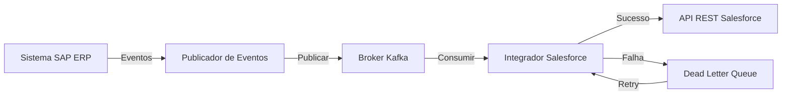
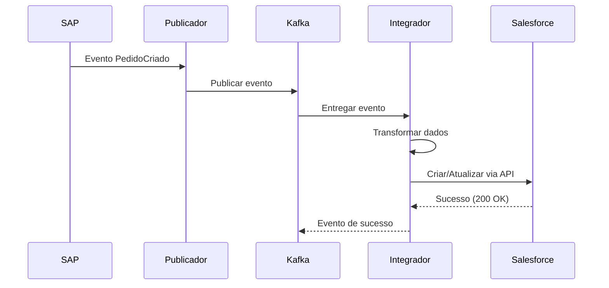
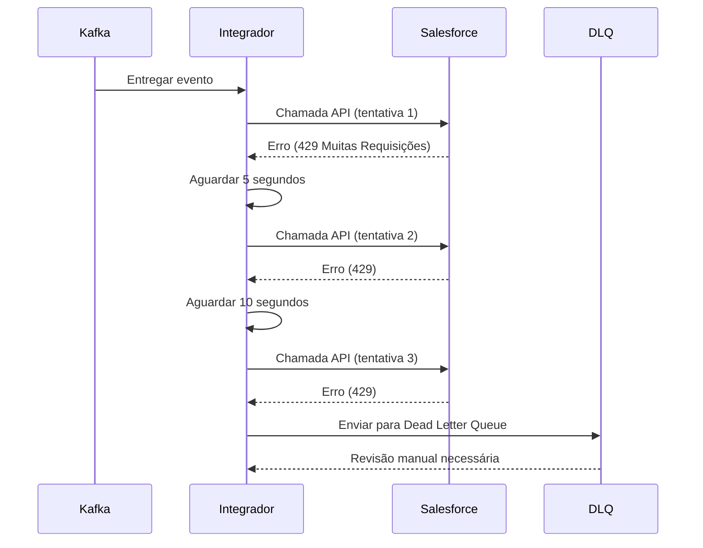
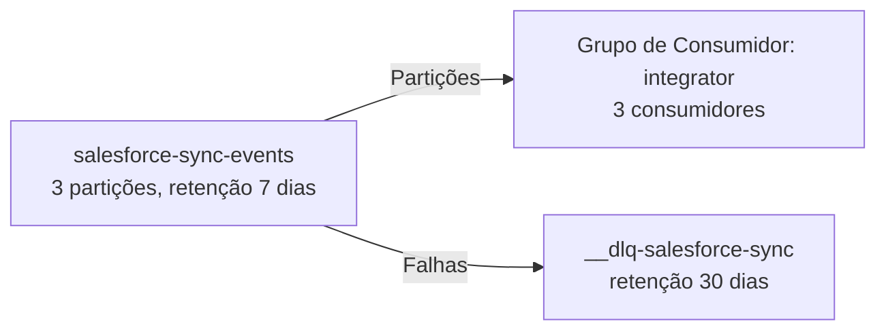
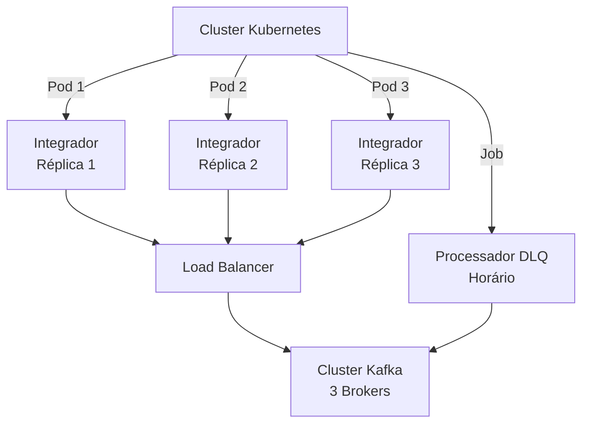

# Exemplo: Diagramas Mermaid para Integração Salesforce-SAP

## 1. Arquitetura do Sistema

## 2. Sequência de Fluxo de Dados

## 3. Fluxo de Tratamento de Erros

## 4. Topologia de Tópico Kafka

## 5. Arquitetura de Deployment

## Legenda

- **Caixas azuis** = Serviços internos
- **Caixas verdes** = Infraestrutura de mensagens
- **Caixas vermelhas** = Sistemas externos
- **Linhas sólidas** = Chamadas síncronas
- **Linhas tracejadas** = Eventos/Assíncronos
- **Números** = Ordem de sequência

---

## Usando Esses Diagramas

Esses diagramas podem ser:
1. Incluídos na documentação HLD
2. Apresentados a stakeholders
3. Usados em revisões de arquitetura
4. Referenciados em guias de implementação
5. Atualizados conforme a arquitetura evolui

## Atualizando Diagramas

Quando a arquitetura muda:
1. Atualizar o código Mermaid
2. Fazer commit no controle de versão
3. Atualizar referências cruzadas na documentação
4. Notificar equipes relevantes
