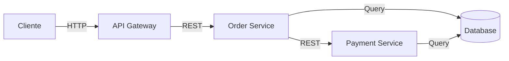
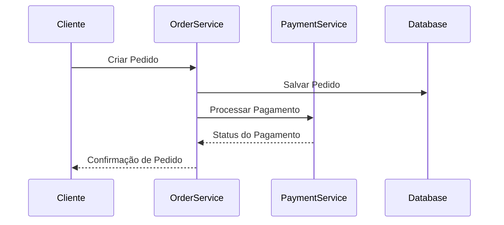
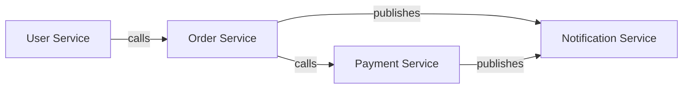

# Padrões de Diagrama Mermaid

Padrões para criação de diagramas Mermaid em arquitetura.

---

## Tipos de Diagrama

### 1. Flowchart (Visão Geral de Arquitetura)


---

### 2. Sequence Diagram (Fluxo de Integração)


---

### 3. Graph (Relacionamento de Componentes)


---

## Padrões de Nomenclatura

### Componentes
- `PascalCase` para nomes de componentes
- Nomes descritivos
- Incluir tecnologia se importante

**Exemplos**:
- `Order Service`
- `PostgreSQL Database`
- `Kafka Event Broker`
- `API Gateway`

---

## Convenções de Cor

| Tipo | Cor | Hex |
|---|---|---|
| Serviço | Azul | #1E90FF |
| Banco de Dados | Verde | #228B22 |
| Fila | Amarelo | #FFD700 |
| Externo | Vermelho | #FF4500 |
| Cache | Roxo | #9932CC |

---

## Legenda

Todos os diagramas devem incluir legenda:
```
## Legenda
- Caixa azul = Serviço Interno
- Cilindro verde = Banco de Dados
- Quadrado amarelo = Fila de Mensagens
- Caixa vermelha = Sistema Externo
```

---

## Regras de Legibilidade

1. **Evitar cruzamento de linhas** quando possível
2. **Agrupar componentes relacionados** juntos
3. **Usar labels descritivos** em setas
4. **Limitar largura** para caber em uma página
5. **Rotular com tecnologia** quando relevante

---

## Documentação

Cada diagrama deve ter:
- Título descrevendo o que mostra
- Legenda explicando símbolos
- Contexto explicando o propósito
- Referência a documentos relacionados

---

## Conformidade

Todos os diagramas devem:
- [ ] Ter sintaxe Mermaid válida
- [ ] Ser legível sem zoom
- [ ] Ter labels claros
- [ ] Ter legenda apropriada
- [ ] Corresponder às decisões de arquitetura
- [ ] Estar em controle de versão
- [ ] Ser atualizados com mudanças

---

## Ferramentas

Ferramentas recomendadas:
- Mermaid Live Editor: mermaid.live
- VS Code Extension: Markdown Preview Mermaid Support
- GitHub: Suporte nativo para Mermaid em arquivos .md
- Draw.io: Import/export Mermaid
