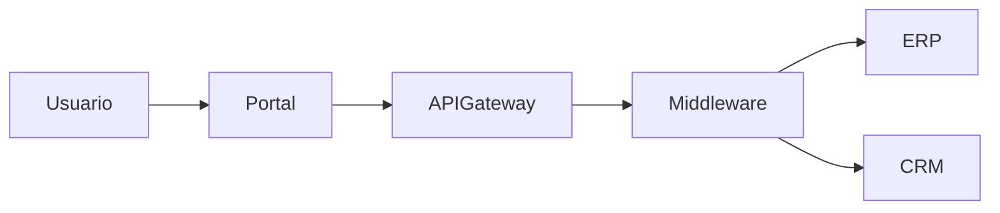
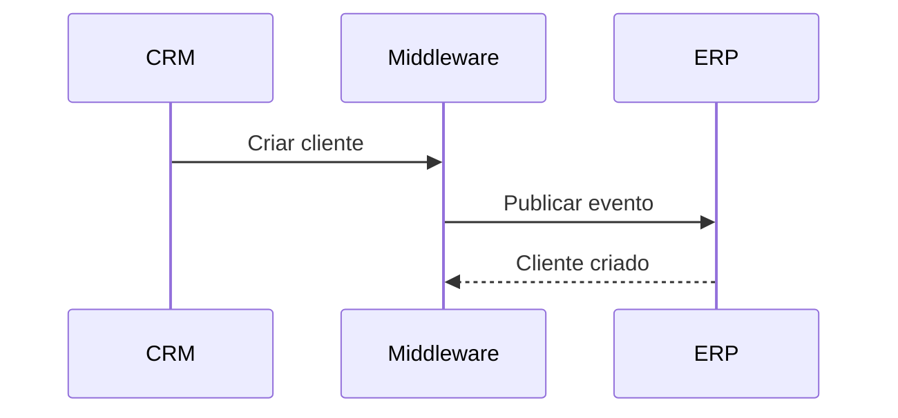

# Template: HLD (High Level Design)

```md
# HLD - [Nome da Solução]

## Document Information

| Campo | Valor |
|---|---|
| Projeto | |
| Sistema | |
| Responsável | |
| Versão | |
| Data | |
| Status | Draft / Review / Approved |

---

# Overview

## Objetivo

Descrever:
- objetivo da solução
- problema que será resolvido
- contexto de negócio
- motivadores
- benefícios esperados

---

## Escopo

### Incluído
- ...
- ...

### Não Incluído
- ...
- ...

---

## Cenário Atual (AS IS)

Descrever:
- arquitetura atual
- limitações
- gargalos
- dependências
- riscos existentes

---

## Cenário Proposto (TO BE)

Descrever:
- visão futura
- melhorias esperadas
- ganhos operacionais
- ganhos técnicos
- redução de riscos

---

# Architecture Overview

## Visão Geral da Arquitetura

Explicar:
- componentes principais
- comunicação entre sistemas
- integrações
- fluxo ponta a ponta
- dependências críticas

---

## Arquitetura High Level



---

# Components

## Componentes da Solução

| Componente | Tipo | Responsabilidade | Criticidade |
|---|---|---|---|
| API Gateway | Infraestrutura | Exposição de APIs | Alta |
| Middleware | Integração | Orquestração | Alta |
| ERP | Sistema Core | Processamento financeiro | Crítica |

---

## Descrição dos Componentes

### [Nome do Componente]

#### Objetivo
...

#### Responsabilidades
- ...
- ...

#### Dependências
- ...
- ...

#### Tecnologias
- ...
- ...

#### Observações
...

---

# Integrations

## Integrações Envolvidas

| Origem | Destino | Tipo | Protocolo | Sync/Async | Criticidade |
|---|---|---|---|---|---|
| CRM | Middleware | API | REST | Sync | Alta |
| Middleware | ERP | Evento | Kafka | Async | Crítica |

---

## Fluxo de Integração

Descrever:
1. origem do evento
2. processamento
3. transformação
4. integração
5. persistência
6. retorno

---

## Fluxo Mermaid



---

# Data Flow

## Fluxo de Dados

Descrever:
- origem dos dados
- transformação
- persistência
- consumo
- retenção
- auditoria

---

## Dados Sensíveis

Identificar:
- PII
- dados financeiros
- documentos
- credenciais

Definir:
- criptografia
- mascaramento
- retenção
- auditoria

---

# Security

## Segurança

Avaliar:
- autenticação
- autorização
- segregação de acesso
- criptografia
- API Gateway
- WAF
- IAM
- mTLS
- OAuth2
- JWT

---

## LGPD e Compliance

Considerar:
- retenção de dados
- consentimento
- rastreabilidade
- auditoria
- anonimização
- exclusão de dados

---

# Observability

## Observabilidade

Definir:
- logs
- métricas
- tracing
- alertas
- dashboards
- correlation-id

---

## Monitoramento

Definir:
- health check
- SLA
- SLO
- alertas críticos
- reprocessamento

---

# NFR

## Requisitos Não Funcionais

| Categoria | Requisito | Criticidade |
|---|---|---|
| Performance | Tempo de resposta menor que 2s | Alta |
| Disponibilidade | SLA 99.9% | Alta |
| Segurança | OAuth2 obrigatório | Crítica |
| Observabilidade | Tracing distribuído | Alta |

---

## Performance

Definir:
- throughput
- concorrência
- latência
- volume esperado

---

## Escalabilidade

Definir:
- crescimento esperado
- estratégia horizontal/vertical
- limites conhecidos

---

## Resiliência

Definir:
- retry
- DLQ
- timeout
- circuit breaker
- fallback
- idempotência

---

# Risks

## Riscos Arquiteturais

| Risco | Impacto | Probabilidade | Mitigação |
|---|---|---|---|
| Dependência de fornecedor | Alta | Média | Estratégia multi-vendor |
| Integração síncrona crítica | Alta | Alta | Migrar para async |

---

## SPOF (Single Point of Failure)

Listar:
- componentes críticos
- dependências críticas
- riscos de indisponibilidade

---

# Dependencies

## Dependências

| Dependência | Tipo | Impacto |
|---|---|---|
| ERP | Sistema core | Crítico |
| API Externa | Fornecedor | Alto |

---

# Assumptions

## Premissas

Listar:
- decisões assumidas
- limitações
- restrições
- dependências externas

---

# Open Questions

## Dúvidas Abertas

Listar:
- gaps
- pendências
- validações necessárias

---

# Roadmap

## Próximos Passos

### Curto Prazo
- ...
- ...

### Médio Prazo
- ...
- ...

### Longo Prazo
- ...
- ...

---

# Recommendations

## Recomendações Arquiteturais

Sugerir:
- melhorias
- desacoplamento
- observabilidade
- segurança
- otimizações
- modernização

---

# Appendix

## Referências

Relacionar:
- ADRs
- diagramas
- RFCs
- atas
- contratos
- APIs
- documentação técnica
