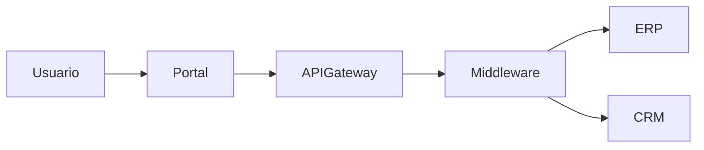
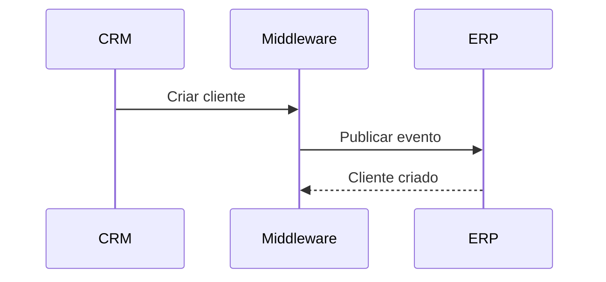

# Template: HLD (Projeto de Alto Nível)

```md
# HLD - [Nome da Solução]

## Informações do Documento

| Campo | Valor |
|---|---|
| Projeto | |
| Sistema | |
| Responsável | |
| Versão | |
| Data | |
| Status | Rascunho / Revisão / Aprovado |

---

# Visão Geral

## Objetivo

Descreva:
- objetivo da solução
- problema que será resolvido
- contexto de negócio
- motivadores
- benefícios esperados

---

## Escopo

### Incluído
- ...
- ...

### Não Incluído
- ...
- ...

---

## Cenário Atual (AS IS)

Descreva:
- arquitetura atual
- limitações
- gargalos
- dependências
- riscos existentes

---

## Cenário Proposto (TO BE)

Descreva:
- visão futura
- melhorias esperadas
- ganhos operacionais
- ganhos técnicos
- redução de riscos

---

# Visão Geral da Arquitetura

## Visão Geral da Arquitetura

Explique:
- componentes principais
- comunicação entre sistemas
- integrações
- fluxo ponta a ponta
- dependências críticas

---

## Arquitetura de Alto Nível



---

# Componentes

## Componentes da Solução

| Componente | Tipo | Responsabilidade | Criticidade |
|---|---|---|---|
| API Gateway | Infraestrutura | Exposição de APIs | Alta |
| Middleware | Integração | Orquestração | Alta |
| ERP | Sistema Core | Processamento financeiro | Crítica |

---

## Descrição dos Componentes

### [Nome do Componente]

#### Objetivo
...

#### Responsabilidades
- ...
- ...

#### Dependências
- ...
- ...

#### Tecnologias
- ...
- ...

#### Observações
...

---

# Integrações

## Integrações Envolvidas

| Origem | Destino | Tipo | Protocolo | Sync/Async | Criticidade |
|---|---|---|---|---|---|
| CRM | Middleware | API | REST | Sync | Alta |
| Middleware | ERP | Evento | Kafka | Async | Crítica |

---

## Fluxo de Integração

Descreva:
1. origem do evento
2. processamento
3. transformação
4. integração
5. persistência
6. retorno

---

## Diagrama de Fluxo



---

# Fluxo de Dados

## Fluxo de Dados

Descreva:
- origem dos dados
- transformação
- persistência
- consumo
- retenção
- auditoria

---

## Dados Sensíveis

Identifique:
- PII
- dados financeiros
- documentos
- credenciais

Defina:
- criptografia
- mascaramento
- retenção
- auditoria

---

# Segurança

## Segurança

Avalie:
- autenticação
- autorização
- segregação de acesso
- criptografia
- API Gateway
- WAF
- IAM
- mTLS
- OAuth2
- JWT

---

## LGPD e Compliance

Considere:
- retenção de dados
- consentimento
- rastreabilidade
- auditoria
- anonimização
- exclusão de dados

---

# Observabilidade

## Observabilidade

Defina:
- logs
- métricas
- tracing
- alertas
- dashboards
- Correlation ID

---

## Monitoramento

Defina:
- health check
- SLA
- SLO
- alertas críticos
- reprocessamento

---

# RNF

## Requisitos Não Funcionais

| Categoria | Requisito | Criticidade |
|---|---|---|
| Performance | Tempo de resposta menor que 2s | Alta |
| Disponibilidade | SLA 99.9% | Alta |
| Segurança | OAuth2 obrigatório | Crítica |
| Observabilidade | Tracing distribuído | Alta |

---

## Performance

Defina:
- throughput
- concorrência
- latência
- volume esperado

---

## Escalabilidade

Defina:
- crescimento esperado
- estratégia horizontal/vertical
- limites conhecidos

---

## Resiliência

Defina:
- retry
- DLQ
- timeout
- circuit breaker
- fallback
- idempotência

---

# Riscos

## Riscos Arquiteturais

| Risco | Impacto | Probabilidade | Mitigação |
|---|---|---|---|
| Dependência de fornecedor | Alta | Média | Estratégia multi-vendor |
| Integração síncrona crítica | Alta | Alta | Migrar para async |

---

## SPOF (Ponto Único de Falha)

Liste:
- componentes críticos
- dependências críticas
- riscos de indisponibilidade

---

# Dependências

## Dependências

| Dependência | Tipo | Impacto |
|---|---|---|
| ERP | Sistema core | Crítico |
| API Externa | Fornecedor | Alto |

---

# Premissas

## Premissas

Liste:
- decisões assumidas
- limitações
- restrições
- dependências externas

---

# Questões Abertas

## Dúvidas Abertas

Liste:
- gaps
- pendências
- validações necessárias

---

# Roteiro

## Próximos Passos

### Curto Prazo
- ...
- ...

### Médio Prazo
- ...
- ...

### Longo Prazo
- ...
- ...

---

# Recomendações

## Recomendações Arquiteturais

Sugira:
- melhorias
- desacoplamento
- observabilidade
- segurança
- otimizações
- modernização

---

# Apêndice

## Referências

Relacione:
- ADRs
- diagramas
- RFCs
- atas
- contratos
- APIs
- documentação técnica
```
